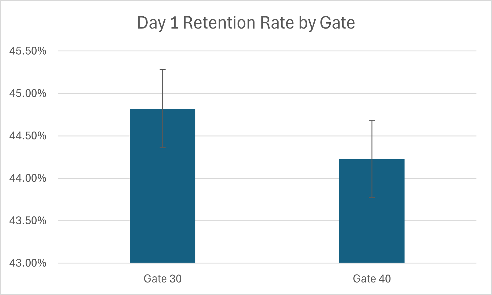
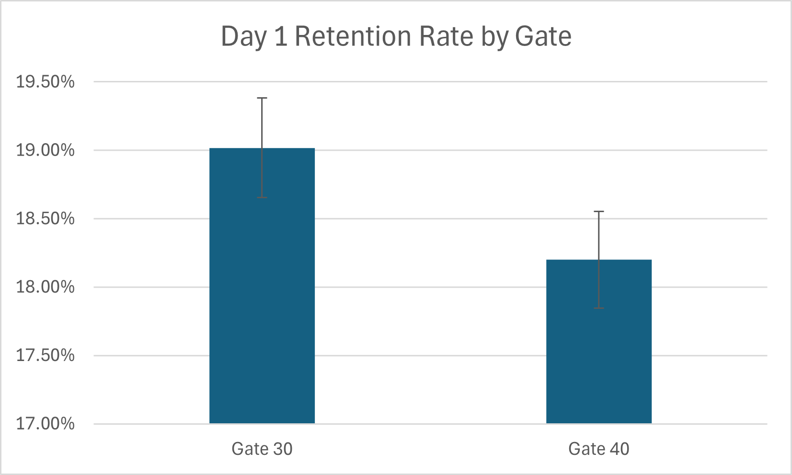

# Cookie Cats A/B Test: Impact of Game Progression Design on Player Engagement & Retention

An analysis of the **Cookie Cats mobile game A/B test** (Kaggle dataset), examining whether moving the game's first progression gate from **level 30 to level 40** affects player engagement (rounds played) and retention (Day 1 / Day 7).

> **TL;DR:** Moving the gate to level 40 produced **no measurable engagement benefit** and was associated with a **statistically significant drop in Day-7 retention**. The data supports keeping the gate at level 30.

---

## 1. Problem Statement

Cookie Cats is a mobile puzzle game with progression "gates" that force players to wait or pay to continue. This project tests whether delaying the first gate (30 → 40) helps or hurts:

- **Engagement** — how many rounds players play
- **Retention** — whether players return the next day (Day 1) and a week later (Day 7)

**Dataset:** 90,189 players randomly assigned to `gate_30` (control) or `gate_40` (treatment), with `sum_gamerounds`, `retention_1`, and `retention_7` recorded per user.

---

## 2. Methodology

| Step | What was done |
|---|---|
| Data cleaning | Identified and removed one extreme outlier (see §3) |
| Descriptive statistics | Mean, median, SD, skewness, kurtosis for game rounds, by group |
| Distribution analysis | Frequency buckets and engagement-tier breakdown, by group |
| Probability analysis | Marginal, conditional, and Bayes'-rule probabilities linking gate version and retention |
| Hypothesis testing | Two-sample t-test (engagement), two-proportion z-tests (retention), chi-square test of independence (retention) |
| Visualization | Retention rate charts with 95% confidence interval error bars |

All analysis was performed in Excel; formulas and full working are in [`cookie_cats.xlsx`](./cookie_cats.xlsx).

---

## 3. Data Quality: Outlier Handling

One user (44,700 in `gate_30`) recorded **49,854 game rounds** — nearly 17x higher than the next-highest player in the entire dataset (2,961). This single point inflated `gate_30`'s variance by roughly 6x and its kurtosis to over 31,000, which would have distorted any parametric test run on the raw data. This row was excluded before running descriptive statistics and hypothesis tests, and both groups' sample sizes were adjusted accordingly (44,699 / 45,489).

---

## 4. Key Findings

### 4.1 Engagement (Game Rounds Played)

| Metric | Gate 30 | Gate 40 |
|---|---|---|
| Mean rounds | 51.34 | 51.30 |
| Median rounds | 17 | 16 |
| Std. Deviation | 102.06 | 103.29 |
| Skewness | 5.94 | 5.97 |

The distribution is heavily right-skewed in both groups — most players engage lightly, while a small minority play far more than average. Mean and median engagement are effectively identical between gates.

**Hypothesis test (t-test, equal variances — variance ratio ≈ 1.02 after outlier removal):**

- t = 0.063, df = 90,186
- p (two-tailed) = 0.949

**Result: No statistically significant difference in game rounds played between Gate 30 and Gate 40.** Moving the gate does not measurably change how much players engage with the game.

### 4.2 Engagement Distribution (Probability Breakdown)

| Engagement tier | Gate 30 | Gate 40 |
|---|---|---|
| Low (0–20 rounds) | 54.8% | 55.7% |
| Medium (21–100 rounds) | 31.6% | 30.5% |
| High (>100 rounds) | 13.6% | 13.8% |

The two groups are nearly identical across every engagement tier, reinforcing the t-test result: gate placement does not shift players toward higher or lower engagement bands. High-volume players (>1,000 rounds) are rare in both groups (~0.12–0.14%).

### 4.3 Retention — Day 1

| Metric | Gate 30 | Gate 40 |
|---|---|---|
| Retention rate | 44.82% | 44.23% |
| 95% CI | [44.36%, 45.28%] | [43.77%, 44.69%] |

**Two-proportion z-test:** z = -1.787, two-tailed p = 0.0739
**Chi-square test:** χ² = 3.19, p = 0.0739 (df = 1)

**Result: No statistically significant difference in Day 1 retention** (confidence intervals overlap; both tests agree at p ≈ 0.074, just above the 0.05 threshold).

### 4.4 Retention — Day 7

| Metric | Gate 30 | Gate 40 |
|---|---|---|
| Retention rate | 19.02% | 18.20% |
| 95% CI | [18.66%, 19.38%] | [17.85%, 18.55%] |

**Two-proportion z-test:** z = -3.157, two-tailed p = 0.00159
**Chi-square test:** χ² = 9.97, p = 0.00159 (df = 1)

**Result: Statistically significant difference in Day 7 retention.** Confidence intervals do not overlap, and both independent tests agree precisely. Players with the gate at level 30 return a week later at a meaningfully higher rate than those with the gate at level 40.

### 4.5 Probability & Bayes' Rule Insights

- **P(Gate 30) = 49.6%, P(Gate 40) = 50.4%** — the random assignment split is close to even, as expected for a valid A/B test.
- **P(Retained Day 1) = 44.5%, P(Retained Day 7) = 18.6%** — as expected, retention drops sharply between Day 1 and Day 7 regardless of gate.
- **Applying Bayes' rule to Day 7 retention:** among players who *were* retained on Day 7, **50.66% came from Gate 30** versus 49.34% from Gate 40 — despite the overall population being slightly tilted the other way (49.6% / 50.4%). In other words, Gate 30 is *overrepresented* among long-term-retained players relative to its share of the total population. This is the same signal as the z-test and chi-square results, seen from a different angle: being retained a week later is more strongly associated with having had the gate at level 30.
- The equivalent Bayes' figures for Day 1 (49.89% / 50.11%) show essentially no such skew — consistent with Day 1 showing no significant effect.

---

## 5. Business Insights & Recommendation

1. **Engagement is unaffected by gate placement.** Players play roughly the same number of rounds whether the gate sits at level 30 or 40 — delaying the gate does not "hook" players into more gameplay.
2. **Short-term retention (Day 1) is unaffected**, but **long-term retention (Day 7) is measurably worse with the later gate.** The Day 7 effect is small in absolute terms (≈0.8 percentage points) but statistically robust — confirmed independently by a z-test, a chi-square test, and a Bayes'-rule cross-check, all agreeing to three decimal places.
3. **Recommendation: Keep the progression gate at level 30.** There is no engagement upside to moving it to level 40, and doing so carries a real, if modest, cost to week-long retention — a metric closely tied to long-term player lifetime value and ad/IAP revenue potential.

---

## 6. Visualizations

Each chart shows retention rate by gate with 95% confidence interval error bars — the Day 1 bars visibly overlap (no significant difference), while the Day 7 bars are visibly separated (significant difference), making the core finding readable at a glance.

---

## 7. Tools Used

- **Microsoft Excel** — data cleaning, descriptive statistics, Data Analysis ToolPak (t-test), pivot tables, formula-based z-tests and chi-square tests, chart-based visualization

## 8. Repository Contents

| File | Description |
|---|---|
| `cookie_cats.xlsx` | Full analysis workbook — raw data, descriptive stats, distribution analysis, probability/Bayes calculations, hypothesis tests, and visualizations |
| `README.md` | This summary |

## 9. Dataset Source

[Mobile Games A/B Testing — Cookie Cats (Kaggle)](https://www.kaggle.com/datasets/mursideyarkin/mobile-games-ab-testing-cookie-cats)

---

*Analysis by Paramartha*
